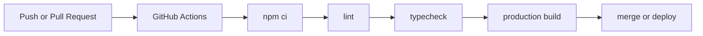

# CI/CD

Bachelor Buddy uses a simple GitHub Actions pipeline.

## Workflow

## Why this shape

- Catches formatting or lint issues early
- Verifies TypeScript correctness
- Confirms the production build still succeeds
- Keeps the pipeline easy to maintain
