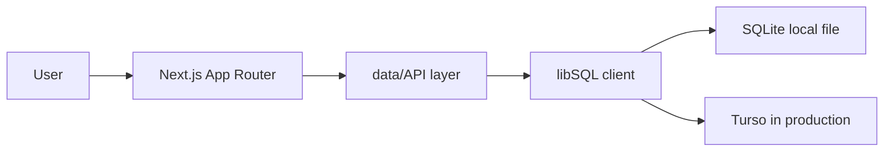
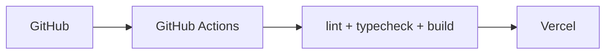

# High-Level Architecture

Bachelor Buddy is a small marketplace MVP built to search, compare, and enquire about local services in Bengaluru.

## Request Flow

## Deployment Flow

## Notes

- Local development uses the SQLite file under `data/`.
- Production should use Turso/libSQL through environment variables.
- The app keeps the data layer thin so the MVP stays easy to reason about in interviews.
