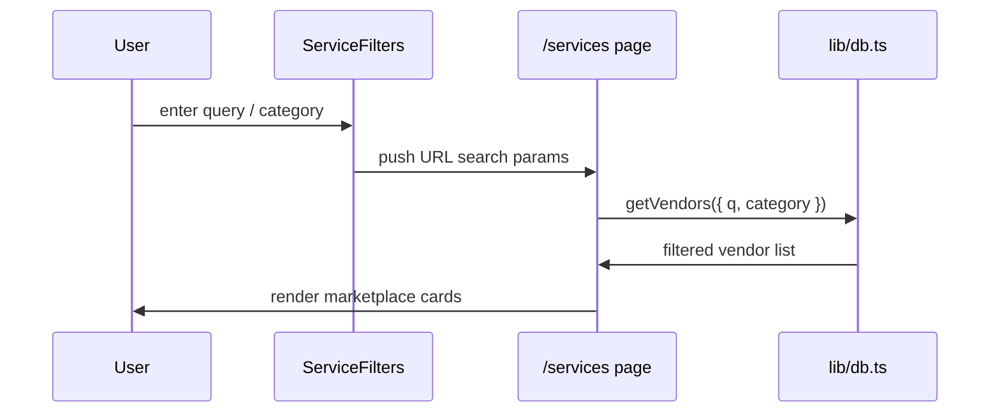
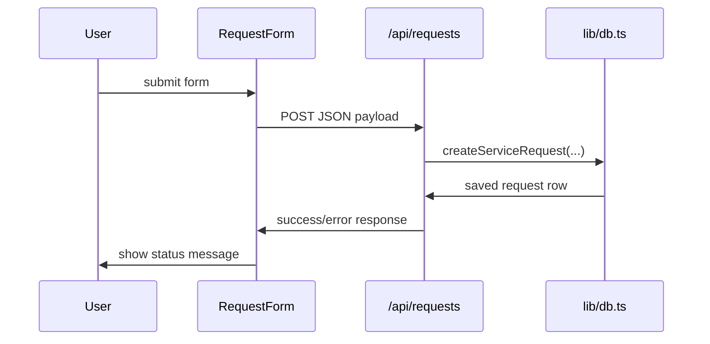

# Low-Level Design

## Core Files

- `app/page.tsx`
  - Landing page with hero, popular services, how-it-works, and vendor CTA.
- `app/services/page.tsx`
  - Marketplace listing page with filters, vendor cards, enquiry form, and recent requests.
- `components/service-filters.tsx`
  - Client-side search and category filter state synced to the URL.
- `components/request-form.tsx`
  - Client-side enquiry form with validation, loading state, success and error handling.
- `lib/data.ts`
  - Shared categories, seed vendors, hero content, and copy used by the UI.
- `lib/db.ts`
  - Database access layer for vendors and service requests.

## Search and Filter Flow

## Enquiry Flow

## Data Mapping

- Vendors are stored with `category`, `area`, `price`, `rating`, `response_time`, and JSON `tags`.
- Service requests are stored with the submitted user details and timestamp.
- Queries are parameterized in `lib/db.ts` to keep the data layer safe and simple.
